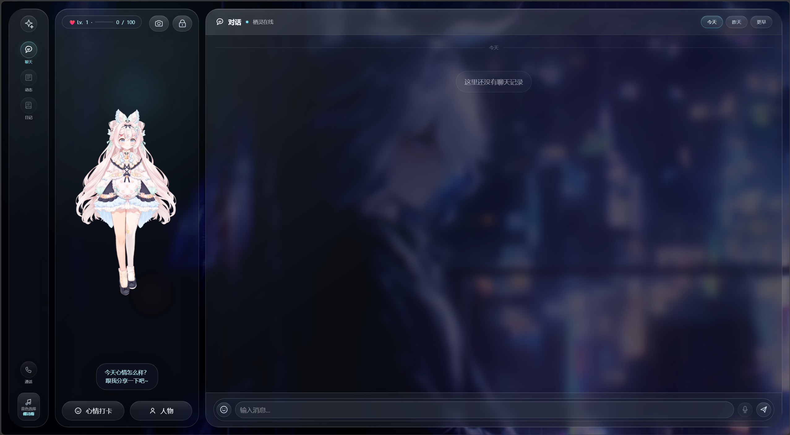

# xiling-ai-companion
Artificial Intelligence Project
<div align="center">

# 栖灵 AI 虚拟陪伴助手

**Xiling AI Companion**

一个融合 **Live2D 角色互动、AI 对话、情绪陪伴、语音朗读与管理后台** 的本地 Web 应用。  
A local web application that combines **Live2D character interaction, AI chat, emotional companionship, voice read-aloud, and an admin console**.

<br />



<br />
<br />


</div>

---

## 项目概览 · Overview

栖灵 AI 是一个面向本地部署和产品原型验证的 AI 虚拟陪伴项目。它使用 Node.js 与 Express 提供后端服务，使用 SQLite 保存本地数据，前端采用原生 HTML/CSS/JavaScript 实现，不需要额外构建步骤。配置 DeepSeek API Key 后即可接入真实大模型；未配置时也可以使用模拟回复完成本地演示。

Xiling AI is an AI companion project designed for local deployment and product prototyping. It uses Node.js and Express for the backend, SQLite for local data storage, and plain HTML/CSS/JavaScript for the frontend without an additional build step. With a DeepSeek API key, it can connect to a real LLM; without one, it falls back to mock responses for local demos.

---

## 功能亮点 · Features

| 功能 | Description |
|---|---|
| AI 陪伴聊天 | Daily companion chat powered by DeepSeek or local mock responses |
| Live2D 角色互动 | Live2D character loading, switching, expressions, and motions |
| 情绪打卡 | Daily mood check-ins that influence later conversations |
| 语音朗读 | Browser speech synthesis with optional offline Sherpa-ONNX TTS support |
| 动态与日记 | AI-generated moments and diaries based on user interactions |
| 危机关键词识别 | Crisis keyword matching with alert records and optional webhook notification |
| 管理后台 | Admin dashboard for users, alerts, mood stats, system config, and keywords |
| 本地数据存储 | SQLite-based local runtime data with simple deployment requirements |

---

## 技术栈 · Tech Stack

| Layer | Technology |
|---|---|
| Backend | Node.js, Express |
| Database | SQLite, better-sqlite3 |
| Frontend | HTML, CSS, JavaScript |
| AI | DeepSeek Chat Completions API |
| Character Runtime | PIXI, Live2D Cubism, pixi-live2d-display |
| Voice | Web Speech API, Sherpa-ONNX optional support |
| Configuration | dotenv |

---

## 快速开始 · Quick Start

### 1. 安装依赖 · Install dependencies

```bash
npm install
```

### 2. 创建配置文件 · Create environment file

```bash
cp .env.example .env
```

Windows 命令行也可以使用：

```bash
copy .env.example .env
```

### 3. 配置环境变量 · Configure environment variables

```env
DEEPSEEK_API_KEY=your_deepseek_api_key_here
PORT=3000
HOST=0.0.0.0
ADMIN_USERNAME=admin
ADMIN_PASSWORD=admin123
ALERT_WEBHOOK_URL=
ALERT_EMAIL=
```

| Variable | Description |
|---|---|
| `DEEPSEEK_API_KEY` | DeepSeek API Key. Leave empty to use mock AI responses. |
| `PORT` | Server port, default `3000`. |
| `HOST` | Server host, default `0.0.0.0`. |
| `ADMIN_USERNAME` | Admin console username. |
| `ADMIN_PASSWORD` | Admin console password. |
| `ALERT_WEBHOOK_URL` | Optional webhook for crisis alerts. |
| `ALERT_EMAIL` | Reserved email alert configuration. |

### 4. 启动服务 · Start the server

```bash
npm start
```

或者：

```bash
npm run dev
```

### 5. 打开应用 · Open the app

| Page | URL |
|---|---|
| 用户端 Main App | <http://localhost:3000> |
| 管理后台 Admin Console | <http://localhost:3000/admin> |

---

## 测试 · Tests

```bash
npm test
```

---

## 项目结构 · Project Structure

```text
.
├── server.js                 # Backend entry and API routes
├── package.json              # npm scripts and dependencies
├── package-lock.json         # Dependency lockfile
├── .env.example              # Environment variable template
├── public/
│   ├── index.html            # Main user interface
│   ├── admin.html            # Admin console interface
│   ├── css/                  # Stylesheets
│   ├── js/                   # Frontend modules
│   ├── lib/                  # Third-party frontend runtime libraries
│   └── model/                # Optional Live2D / TTS assets
├── tests/                    # Test files
├── docs/                     # Documentation
├── show.png                  # Project preview image
└── LICENSE
```

---

## 资源说明 · Assets

为了保持仓库轻量并避免第三方资源授权问题，开源版本可能不包含 Live2D 模型、TTS ONNX 模型和背景视频。需要完整体验相关功能时，请准备合法授权的资源并放置到项目对应路径。

To keep the repository lightweight and avoid third-party asset redistribution issues, the open-source version may not include Live2D models, TTS ONNX models, or background videos. To enable the full experience, prepare legally licensed assets and place them in the expected paths.

| Asset | Path |
|---|---|
| Live2D models | `public/model/` |
| Original Live2D project files | `Live 2d/` |
| Offline TTS models | `public/model/tts/` or `~/.xiling-tts/sherpa/` |
| Background videos | `Background/` or `public/background/` |

即使没有这些资源，项目仍可启动并体验主要业务流程；未配置 DeepSeek API Key 时，聊天接口会自动使用模拟回复。

The app can still start and demonstrate the main workflow without these assets. If no DeepSeek API key is configured, the chat API automatically uses mock responses.

---

## 数据存储 · Data Storage

运行时数据保存在项目根目录的 SQLite 数据库中，由服务端启动时自动创建。

Runtime data is stored in SQLite files under the project root and is created automatically when the server starts.

```text
xiling.db
xiling.db-wal
xiling.db-shm
```

---

## 许可证 · License

本项目源码使用 MIT License 授权，详见 [LICENSE](./LICENSE)。

The source code of this project is released under the MIT License. See [LICENSE](./LICENSE) for details.

第三方资源，包括 Live2D 模型、TTS 模型、背景媒体和第三方库，应遵循其各自的许可证和使用条款。

Third-party assets, including Live2D models, TTS models, background media, and third-party libraries, are subject to their own licenses and terms of use.
